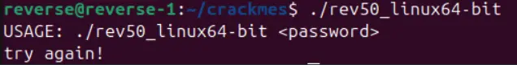
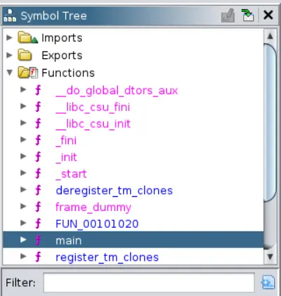
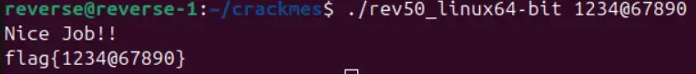

Hello 👋 Today we are going to reverse engineer "easy_reverse" from cbm-hackers.


  Please try to solve this challenge by yourself first before looking at the solution. If you have tried your best and can't solve it, then please don't just take the answer and leave immediately because that is not how you learn reverse engineering. 


### Prerequisites:
1. Ghidra
2. easy_reverse executable (unzip with password "crackmes.one")

### What does it do?
So the program is very simple it just asks us to provide a password when running it.


### Decompiling with Ghidra
Now we will just open it up in Ghidra and analyze it, we'll only enable the "Decompiler Parameter ID" and let the rest be on default.


Once analyzed the main function should automatically pop up in the Decompiled window, if it hasn't you can find it manually by going to the symbol tree and search for it.


Now we can take a look at the code.
   
```c
undefined8 main(int param_1,undefined8 *param_2)

{
  size_t sVar1;

  if (param_1 == 2) {
    sVar1 = strlen((char *)param_2[1]);
    if (sVar1 == 10) {
      if (*(char *)(param_2[1] + 4) == '@') {
        puts("Nice Job!!");
        printf("flag{%s}\n",param_2[1]);
      }
      else {
        usage(*param_2);
      }
    }
    else {
      usage(*param_2);
    }
  }
  else {
    usage(*param_2);
  }
  return 0;
}
```

### Analyzing the code
We see that it checks if our input (param_1) meets the correct conditions. So this should be pretty straight forward 😀 

First it checks if our input is 10 characters long.
```c
if (sVar1 == 10) {
```
If our input is 10 characters long, it will check if the 5th character in our input is a '@' if it is we get the flag. 
```c
if (*(char *)(param_2[1] + 4) == '@') {
  puts("Nice Job!!");
  printf("flag{%s}\n",param_2[1]);
}
```

### Running it with the correct password
So now we can construct a password that meets the correct conditions.


It works and we get the flag!
