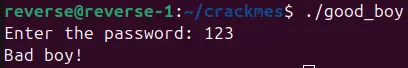
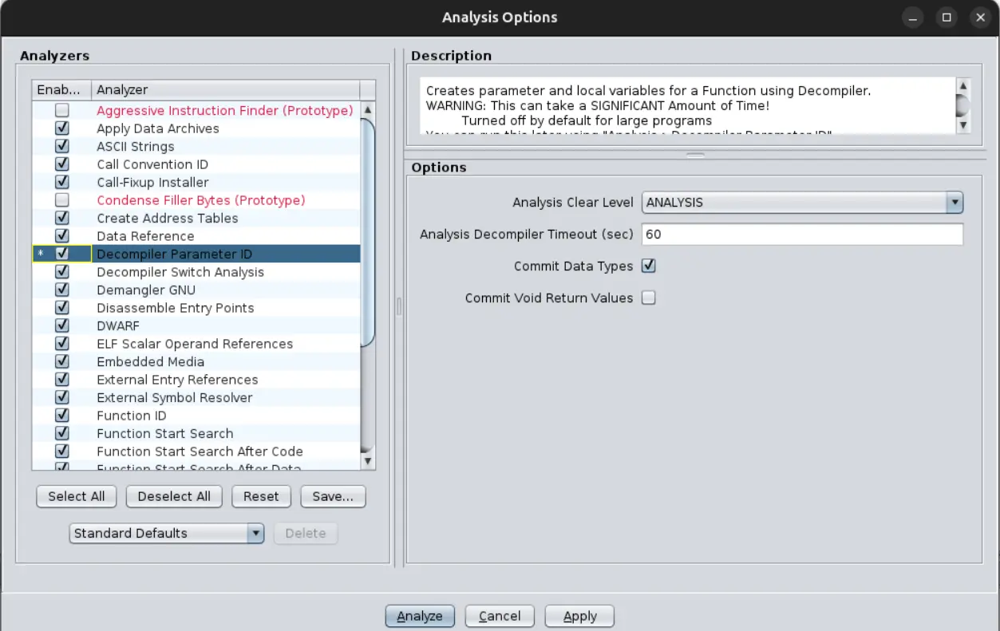
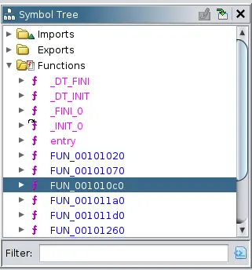
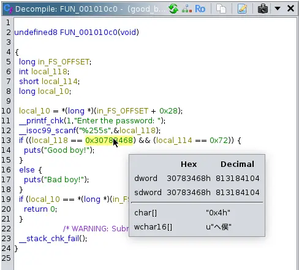
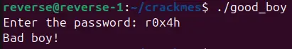
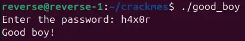

#### Hello 👋 Today we are going to reverse engineer "good_boy" by fdisotto.
**NOTE:** Please try to solve this challenge by yourself first before looking at the solution. If you have tried your best and can't solve it then please don't just take the answer and leave immediately because that is not how you learn reverse engineering. 

### Prerequisites:
1. Ghidra
2. good_boy executable (unzip with password "crackmes.one")

### What does it do?
So the program is very simple it just asks us to provide a password when running it and if we give the false password it calls us a bad boy.


### Decompiling with Ghidra
Now we will just open it up in Ghidra and analyze it, we'll only enable the "Decompiler Parameter ID" and let the rest be on default.


Once analyzed try to find the main function by going to the symbol tree and looking through the functions until we find something that looks like it takes an input.


It looks like FUN_001010c0 is the main function that asks us for the password.
   
```c
undefined8 FUN_001010c0(void)

{
  long in_FS_OFFSET;
  int local_118;
  short local_114;
  long local_10;
  
  local_10 = *(long *)(in_FS_OFFSET + 0x28);
  __printf_chk(1,"Enter the password: ");
  __isoc99_scanf("%255s",&local_118);
  if ((local_118 == 0x30783468) && (local_114 == 0x72)) {
    puts("Good boy!");
  }
  else {
    puts("Bad boy!");
  }
  if (local_10 == *(long *)(in_FS_OFFSET + 0x28)) {
    return 0;
  }
                    /* WARNING: Subroutine does not return */
  __stack_chk_fail();
}
```

#### Analyzing the code
We see that the variable 'local_118' holds our input and it then checks if it meets the correct conditions. 

When we take a look at the code we see that the correct password is hardcoded in ASCII.
```c
if ((local_118 == 0x30783468) && (local_114 == 0x72)) {
  puts("Good boy!");
}
else {
  puts("Bad boy!");
}
```
So now we must decode the ASCII and we can do that by just hovering over the ASCII and Ghidra will decode it for you!


```c
0x30783468 = 0x4h
0x72 = r
```

#### Running it with the correct password
So now we can provide it with the correct password or can we?


At this point I didn't know why the password wouldn't work, so I started searching a bit around and stumbled across the term endianness. 

In a little-endian architecture, the least significant byte is stored first. So it expected h4x0 (0x68347830) but because it is stored with litte-endian architecture it is in reverse order 0x4h (0x30783468).

So let's try typing it in reverse order so the password should be 'h4x0r'


It works and we got the message Good Boy! I hope you learned something new, don't forget to check me out on [Youtube](https://youtube.com/@PrintN42) and [𝕏](https://x.com/PrintN42).
