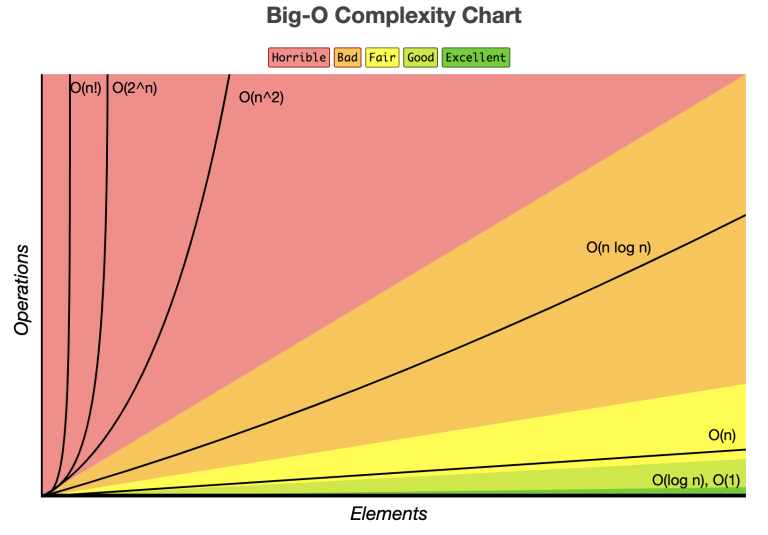

### Introduction to Time Complexity
Time complexity measures how the time to complete an algorithm grows with the size of its input. Understanding time complexity is crucial for optimizing performance in software development.

#### Time Complexity vs. Space Complexity
- **Time Complexity**: Focuses on how long an algorithm takes to run.
- **Space Complexity**: Relates to how much memory an algorithm uses.

Both are essential for efficient software design, as improving one may impact the other.

#### Different notations for time complexity
There are many notations available to compute time complexity:
- **Big O Notation**: O
- **Omega Notation**: Ω
- **Theta Notation**: θ

Our focus is on the Big O Notation today, as it's widely used by developers.

### What is Big O Notation?

_Image from [www.bigocheatsheet.com](./https://www.bigocheatsheet.com/)_

Big O notation provides a way to express the performance of an algorithm. It highlights how the running time or space requirements grow relative to the input size, focusing on the most significant factors and ignoring constant factors.

#### Common Big O Notations
- **O(1)**: Constant time (e.g. accessing an element in an array).
- **O(n)**: Linear time (e.g. looping through an array).
- **O(n²)**: Quadratic time (e.g. nested loops).
- **O(log n)**: Logarithmic time (e.g. binary search).

### How to Calculate Time Complexity
Time complexity is a way to describe how the execution time of a program changes with the size of the input. Let’s explore different examples in Python to illustrate various time complexities.

#### Example 1: Time Complexity O(n)
Here's a simple program that demonstrates O(n) complexity:

```python
def print_numbers(n):
    for i in range(n):
        print(i)  # Executed n times

n = int(input("Enter a number: "))
print_numbers(n)
```
**Time Complexity**: O(n)
- **Explanation**: The for loop runs ```n``` times. If you double the value of ```n```, the time taken by the program also approximately doubles. This is a linear relationship.

#### Example 2: Time Complexity O(1)
Next, consider this snippet that executes a fixed number of operations:

```python
def constant_time_operations():
    a = 5
    b = 10
    sum = a + b  # Single operation
    print("Sum:", sum)

constant_time_operations()
```
**Time Complexity**: O(1)
- **Explanation**: This function performs a fixed number of operations (two assignments and an addition) regardless of any input size. It runs in constant time.

#### Example 3: Time Complexity O(n + 3)
Now, let’s look at a program that includes both a loop and some constant-time operations:

```python
def loop_with_constant_operations(n):
    for i in range(n):
        print(i)  # Executed n times
    print("Done!")  # This is executed once

n = int(input("Enter a number: "))
loop_with_constant_operations(n)
```
**Time Complexity**: O(n + 3)
- **Explanation**: The loop runs ```n``` times, and there are three constant-time operations (two assignments and a print statement). For larger values of ```n```, the constant terms (like +3) becomes petty, so we simplify this to O(n).

#### Example 4: Time Complexity O(n²)
Here’s an example of a nested loop, which results in quadratic time complexity:

```python
def print_pairs(n):
    for i in range(n):
        for j in range(n):
            print(i, j)  # Executed n * n times

n = int(input("Enter a number: "))
print_pairs(n)
```
**Time Complexity**: O(n²)
- **Explanation**: Both loops run ```n``` times. Thus, the total number of iterations is ```n * n```, which results in quadratic time complexity.

#### Example 5: Time Complexity O(log n)
Finally, let’s consider the binary search algorithm, which has logarithmic time complexity:

```python
def binary_search(arr, target):
    left, right = 0, len(arr) - 1

    while left <= right:
        mid = (left + right) // 2
        if arr[mid] == target:
            return mid  # Target found
        elif arr[mid] < target:
            left = mid + 1  # Search right half
        else:
            right = mid - 1  # Search left half
    return -1  # Target not found

# Example usage
arr = [1, 2, 3, 4, 5, 6, 7, 8, 9, 10]
target = 7
result = binary_search(arr, target)
print("Target found at index:", result)
```
**Time Complexity**: O(log n)
- **Explanation**: 
  - **Halving the Search Space**: Each comparison splits the array in half. If the array has ```n``` elements, after the first check, it narrows to ```n / 2```, then ```n / 4```, and so on.
  - **Fewer Comparisons**: For an array of 1,024 elements, it takes only about 10 comparisons to find a target or determine it’s absent.

  This halving results in O(log n) time complexity, meaning the algorithm scales efficiently with larger arrays.

### Summary
**O(n)**: Linear time complexity (e.g. single loop).

**O(1)**: Constant time complexity (e.g. simple arithmetic).

**O(n + 3)**: Linear time with constant operations (simplifies to O(n)).

**O(n²)**: Quadratic time complexity (e.g. nested loops).

**O(log n)**: Logarithmic time complexity (e.g. binary search on a sorted array).

Understanding these examples helps you recognize how different algorithms perform as input sizes change, guiding you in selecting the most efficient algorithm for your needs.