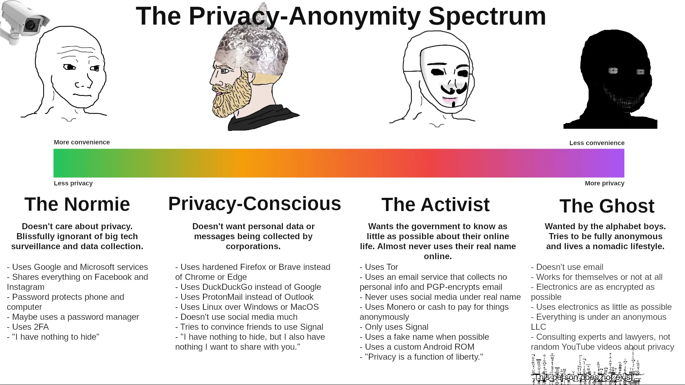

### What Is a Threat Model?
A threat model is a way to systematically identify and evaluate potential security risks to a system or asset. It helps both individuals and organizations recognize their vulnerabilities, understand the possible impacts of different threats, and determine the best strategies to protect against them.

### Assesing Your Threat Model

_https://ericmurphy.xyz/images/spectrum.png_

When assessing your individual threat model, consider the following steps to create a practical and effective strategy:

1. **Self-Assessment and Goals:** Evaluate your privacy needs and set clear goals. Position yourself on the privacy spectrum by asking:

    - Who am I trying to protect myself from?
    - What information am I willing to share online?
    - What are my main privacy concerns, such as tracking by big corporations?

2. **Identify Key Threats:** Focus on the specific threats that align with your privacy goals.

3. **Evaluate Current Practices:** Review your security measures and software to ensure they align with your position on the privacy spectrum.

4. **Implement Practical Solutions:** Choose manageable actions that align with your privacy goals.

5. **Stay Informed and Adapt:** Privacy threats evolve, so stay informed about new risks and best practices. Regularly revisit your threat model and adjust your strategies as needed.

### Conclusion
It's very important to understand your threat model, as everyone's threat model is different. For those who are moderately privacy-conscious, implementing a few practical measures can offer effective protection without resorting to extreme privacy measures.