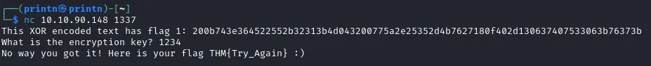
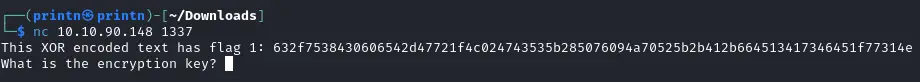
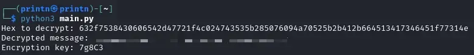
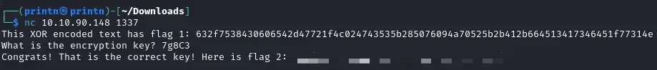

Hello👋 Today we're going to take a look at [W1seGuy](https://tryhackme.com/r/room/w1seguy) room on TryHackMe by hadrian3689 and DrGonz0. The difficulty is easy.
### What Does It Do?
We're being told we have to connect to our target machine IP on port 1337 with Netcat. We can see that it gives us an XOR encrypted string and then asks us to provide an encryption key.


### Analyzing The Code
We're provided with a Source.py file. Let's take a look at it.
```python
import random
import socketserver 
import socket, os
import string

flag = open('flag.txt','r').read().strip()

def send_message(server, message):
    enc = message.encode()
    server.send(enc)

def setup(server, key):
    flag = 'THM{thisisafakeflag}' 
    xored = ""

    for i in range(0,len(flag)):
        xored += chr(ord(flag[i]) ^ ord(key[i%len(key)]))

    hex_encoded = xored.encode().hex()
    return hex_encoded

def start(server):
    res = ''.join(random.choices(string.ascii_letters + string.digits, k=5))
    key = str(res)
    hex_encoded = setup(server, key)
    send_message(server, "This XOR encoded text has flag 1: " + hex_encoded + "\n")
    
    send_message(server,"What is the encryption key? ")
    key_answer = server.recv(4096).decode().strip()

    try:
        if key_answer == key:
            send_message(server, "Congrats! That is the correct key! Here is flag 2: " + flag + "\n")
            server.close()
        else:
            send_message(server, 'Close but no cigar' + "\n")
            server.close()
    except:
        send_message(server, "Something went wrong. Please try again. :)\n")
        server.close()

class RequestHandler(socketserver.BaseRequestHandler):
    def handle(self):
        start(self.request)

if __name__ == '__main__':
    socketserver.ThreadingTCPServer.allow_reuse_address = True
    server = socketserver.ThreadingTCPServer(('0.0.0.0', 1337), RequestHandler)
    server.serve_forever()   
```
In the code, the encryption method used is called XOR encryption. This means that each character in the flag is changed by combining it with a character from a key using a special operation called XOR. Learn more about XOR encryption [here](https://en.wikipedia.org/wiki/XOR_cipher).

The key is 5 characters long, and if the flag is longer than the key, the key starts over from the beginning.

Our goal is to figure out the key and then get back the original flag from the encrypted message.

Since we know the flag starts with "THM{" we can easily find the first four characters of the key using the XOR encrypted string. To find the fifth character of the key, we assume the last character is "}".

### Solution
Copy this code and put it into a .py file.
```python
# Took inspiration from https://github.com/TheSysRat/W1seGuy--THM/blob/main/w1seguy.py
import binascii

def xor_decrypt(hex_string, key):
    encrypted_bytes = binascii.unhexlify(hex_string)
    repeated_key = (key * (len(encrypted_bytes) // len(key) + 1))[:len(encrypted_bytes)]
    return bytes(b ^ ord(repeated_key[i]) for i, b in enumerate(encrypted_bytes)).decode('utf-8')

encrypted_text = input('Hex to decrypt: ')

encrypted_bytes = binascii.unhexlify(encrypted_text)

key = ''.join(chr(encrypted_bytes[i] ^ ord("THM{"[i])) for i in range(len("THM{"))) + \
              ''.join(chr(encrypted_bytes[-i] ^ ord("}")) for i in range(1, len("}") + 1))[:5]

decrypted_message = xor_decrypt(encrypted_text, key)

print(f"Decrypted message: {decrypted_message}")
print(f"Encryption key: {key}")
```

Connect to the server with Netcat and copy the XOR enctrypted string.


Next we'll run the decryptor script and paste the string. We'll get the first flag and also the encryption key for the second flag.


We'll paste the encryption key and we get the second flag!

