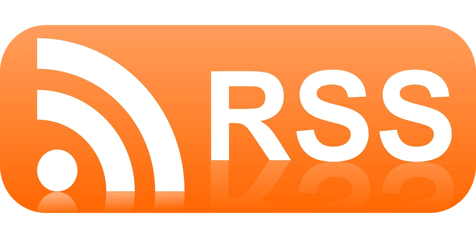

### What is RSS?
RSS (Really Simple Syndication), is a way to get updates from your favorite websites and blogs in one place. It's like a personalized feed that delivers new content from the sites you care about, so you don't have to constantly check them individually.

### Why You Should Start Using RSS
There are many reasons why one should setup a RSS feed. Here are the main reasons.

- **Productivity:** Save time by getting all your favorite content in one place.
- **Privacy:** Your reading habits stay private, no tracking or data selling.
- **Control:** You choose what you see, from who you trust.

### Where Can You Use RSS?
RSS is widely supported across the web. You can find RSS feeds on many websites, blogs, and online services. To access RSS feeds, you will need an RSS feed reader / news aggregator.

### Best RSS Feeders
#### Desktop
###### Linux
- **GUI:** [Akregator](https://apps.kde.org/akregator/)
- **CLI:** [Newsboat](https://newsboat.org/)

###### Windows
- [Fluent](https://www.microsoft.com/store/apps/9P71FC94LRH8?cid=website)

###### MacOS
- [Fluent](https://apps.apple.com/app/id1520907427)

#### Mobile
###### Android
- [Feeder](https://f-droid.org/packages/com.nononsenseapps.feeder/)

###### iOS
- [Feeeed](https://apps.apple.com/us/app/feeeed-rss-reader-and-more/id1600187490)

### Adding YouTube Channels To Your RSS Feed
To add YouTube channels to your RSS feed, follow these steps:

1. Find the channel ID of the YouTube channel you want to subscribe to. To find the channel ID of a YouTube channel, go to the channel, add `view-source:` at the beginning of the URL, then search for `channelId` in the page source code.
2. Paste the channel ID together with this URL into your RSS feed reader:
   
   `https://youtube.com/feeds/videos.xml?channel_id=`

Now you'll be notified of new videos from your favorite YouTube channels without having to sign in or share your personal information.

### Conclusion
RSS feeds are a powerful tool for staying updated, boosting productivity, and protecting your privacy. By using RSS, you can take control of your online experience and enjoy a more focused, efficient, and enjoyable way to consume content. If you want, feel free to subscribe to my RSS feed to get notified when I publish a new post :)